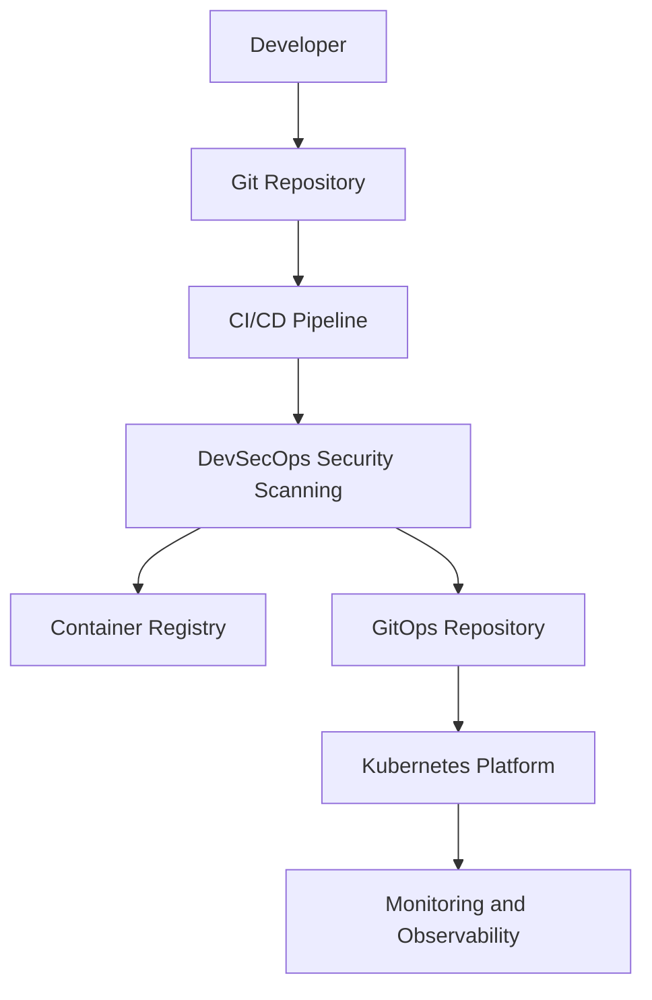
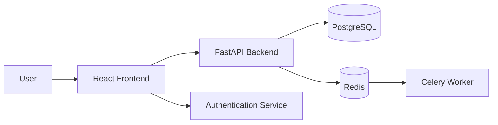
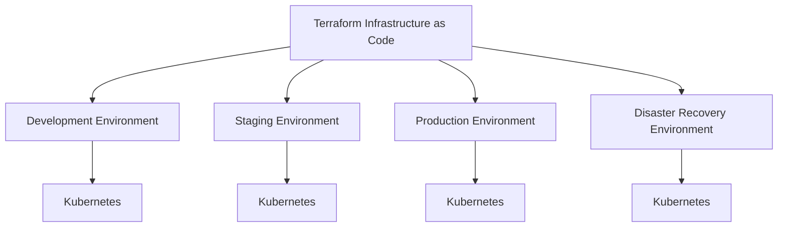
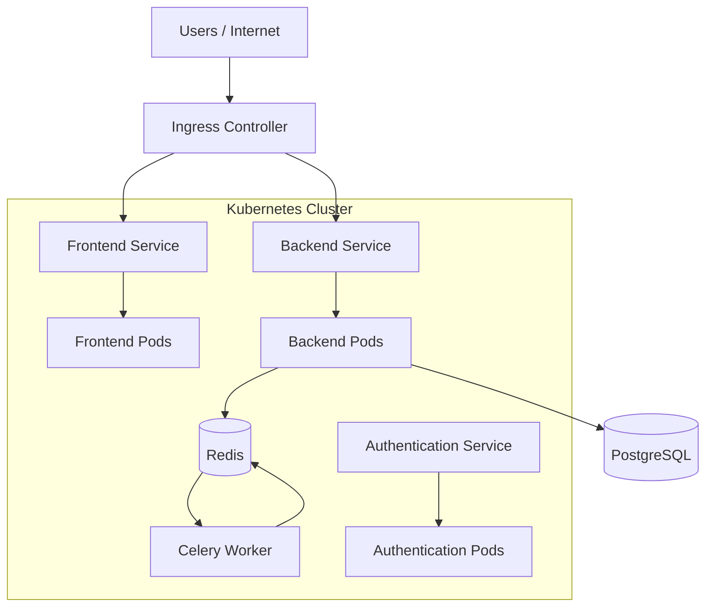
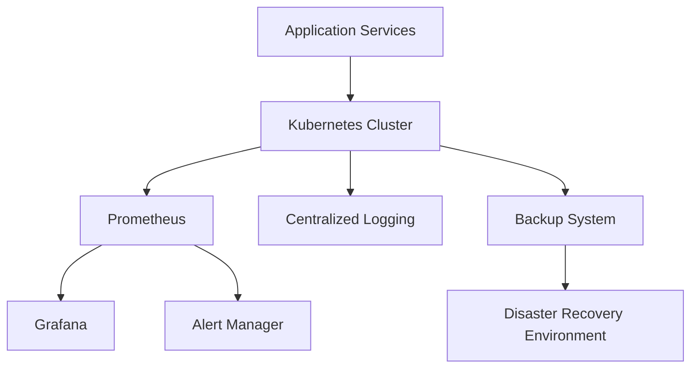

# Enterprise DevSecOps Platform Architecture Diagrams

---

# 1. High-Level Enterprise Architecture

---

# 2. Application Architecture

---

# 3. Infrastructure and Environment Architecture

---

# 4. CI/CD and DevSecOps Pipeline

```mermaid
flowchart LR

    Code[Source Code]

    Validate[Source Validation]

    Test[Unit and Integration Tests]

    Quality[Code Quality]

    Secrets[Secret Scanning]

    Dependencies[Dependency Scanning]

    Build[Container Build]

    ContainerScan[Container Security Scan]

    IaC[IaC Security Scan]

    K8sValidation[Kubernetes Validation]

    Deploy[Deployment]

    Verify[Post Deployment Verification]

    Rollback[Rollback]

    Code --> Validate
    Validate --> Test
    Test --> Quality
    Quality --> Secrets
    Secrets --> Dependencies
    Dependencies --> Build
    Build --> ContainerScan
    ContainerScan --> IaC
    IaC --> K8sValidation
    K8sValidation --> Deploy
    Deploy --> Verify

    Verify -->|Failure| Rollback
```

---

# 5. Kubernetes Architecture

---

# 6. Monitoring and Disaster Recovery Architecture

---

# Architecture Summary

The Enterprise DevSecOps Platform integrates:

- Application services
- Containerization
- Infrastructure as Code
- CI/CD
- DevSecOps security controls
- Kubernetes
- GitOps
- Monitoring
- Logging
- Alerting
- Disaster Recovery
- Reliability engineering
